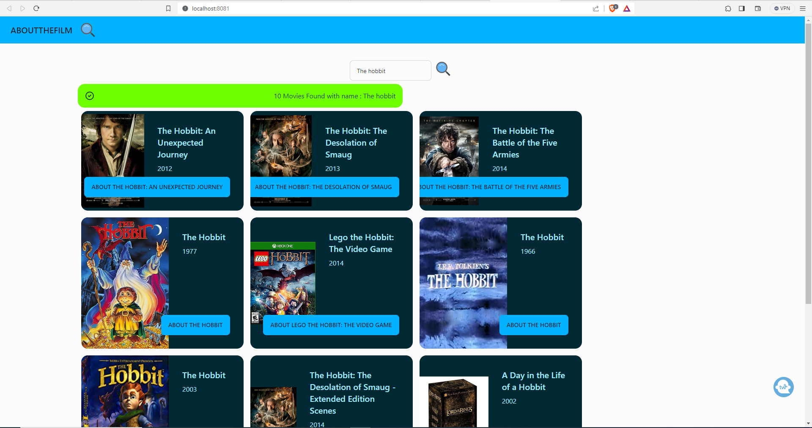

# 🎬 Movie Search App

Welcome to the Movie Search App! This React application lets users explore and discover movies using the OMDB API. 🍿

## Features
- 🎥 Search for movies by title
- 🎞 Display search results with detailed movie information
- 🌐 Responsive design for various devices
- 🚀 Error handling for smooth user experience

## Technologies Used
- ⚛️ React
- 🎬 OMDB API
- 🎨 Tailwind CSS
- 🚀 React Icons

## Getting Started
1. **Clone the repository:**
   ```bash
   git clone https://github.com/your-username/your-repo-name.git
   cd your-repo-name
   ```

2. **Install dependencies:**
   ```bash
   npm install
   ```

3. **Start the development server:**
   ```bash
   npm start
   ```

4. Open [http://localhost:3000](http://localhost:3000) to view the app in your browser.

## Usage
- 🕵️‍♀️ Enter a movie title in the search bar.
- 🚀 Click the search button or press Enter to fetch movie results.
- 🎬 View search results with detailed movie information.

## Contributing
Contributions are welcome! If you have suggestions, bug reports, or want to add features, feel free to open an issue or submit a pull request. Please follow the guidelines in [CONTRIBUTING.md](CONTRIBUTING.md). 🤝

## License
This project is licensed under the MIT License - see the [LICENSE.md](LICENSE.md) file for details.

Happy movie searching! 🍿✨
